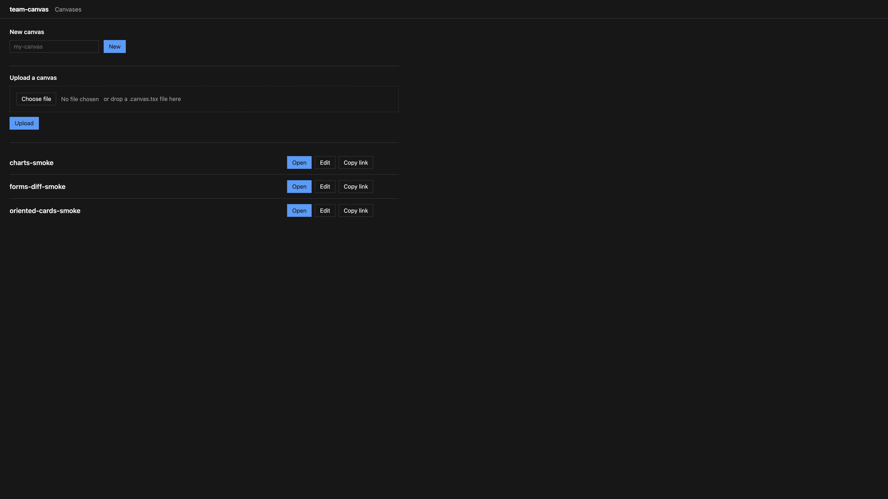
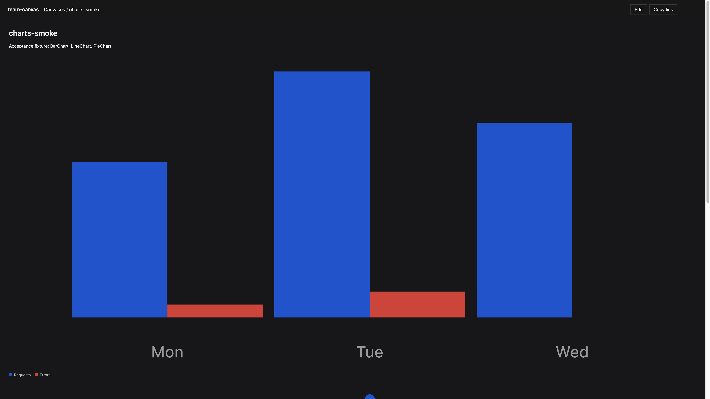
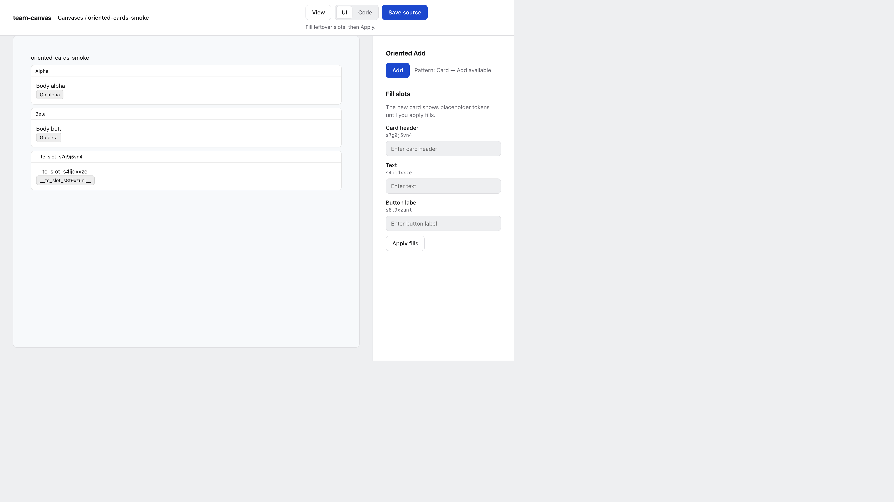
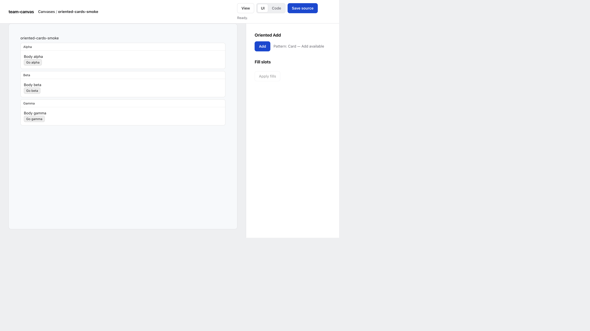
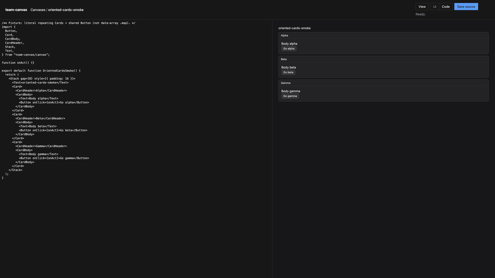

# Getting started

team-canvas turns a `.canvas.tsx` file (one React component) into a page your team can open, share and edit in the browser. This page takes you from install to your first edit in a few minutes.

## 1. Install and run the server

You need Node 20 or newer.

```sh
npm install -g team-canvas
mkdir canvases
team-canvas serve ./canvases            # http://0.0.0.0:3847
```

No global install? `npx team-canvas serve ./canvases` does the same. To import `team-canvas/canvas` in your own React app (see step 7), install it in that project instead: `npm install team-canvas react react-dom`.

`./canvases` is the folder the server reads. Use `--host 127.0.0.1` to keep it on your machine and `--port` to change the port. There is no login, so read the security note in the [README](../README.md#security) before exposing it.

## 2. Create a canvas

Open the server URL, type a name in **New canvas** and press **New**. team-canvas writes a starter file into your folder and opens it in the editor, ready to change. A canvas id may contain `/`. Each segment uses letters, digits, `-` and `_`, and an existing name is never overwritten.

Or write the file yourself. Create `canvases/hello.canvas.tsx`:

```tsx
import { Button, H1, Stack, Text, useCanvasState } from "team-canvas/canvas";

export default function Hello() {
  const [count, setCount] = useCanvasState("count", 0);
  return (
    <Stack gap={12} style={{ padding: 16 }}>
      <H1>Hello</H1>
      <Text>Clicked {count} times</Text>
      <Button onClick={() => setCount(count + 1)}>Click me</Button>
    </Stack>
  );
}
```

A canvas has one default-exported component and imports everything it needs from `team-canvas/canvas`: layout, forms, charts, a diff view, a todo list, DAG layout and theme hooks. `useCanvasState` values are saved next to the file as `hello.canvas.data.json`, so everyone who opens the canvas sees the same state.

## 3. The library

Open the server URL. The library is a tree. Besides **New**, upload is one file in the store root, with the button or by dropping a `.canvas.tsx` on the page. Each canvas has **Open**, **Edit** and **Copy link**.



The example is served with `team-canvas serve examples/okf`. Those ids start at `index`, `guides/editing-workflow`, and `reference/mcp-tools`.

## 4. The viewer

**Open** renders the canvas. When the file changes on disk, the page rebuilds on its own, so you can keep your own editor next to the browser. Build errors show on the page.



## 5. The editor: UI and Code

**Edit** opens the editor. The **UI | Code** switch at the top changes what is next to the live preview.

### Oriented Add

In **UI**, team-canvas looks for a repeating block in your canvas, for example several `Card`s that each have a header, some text and a button. **Add** clones the last one with blank slots. Each slot is named after the element it sits in (Card header, Text, Button label), in the order they appear in the block.



Type the text for each slot and press **Apply fills**. The result is normal source with the same handlers wired up (`onClick` and so on), not a copy of the old text.



You can fill only some slots and apply. The rest stay blank and are still there after a reload.

### Code

**Code** shows the full source next to the preview. Save with the button or Cmd/Ctrl+S. Build errors show in the status line.



## 6. Let an AI agent edit canvases

The same edit operations are available to agents over MCP (stdio):

```json
{
  "mcpServers": {
    "team-canvas": {
      "command": "npx",
      "args": ["-y", "team-canvas", "mcp", "/absolute/path/to/canvases"]
    }
  }
}
```

Tools: `list_canvases`, `create_canvas`, `read_source`, `write_source`, `replace_in_source`, `search_source`, `inspect_orientation`, `add_oriented`, `fill_slots`, `list_links`, `backlinks`, `search_linked`. `create_canvas` takes an `id` and an optional `source`; without a source it writes the same starter canvas as the New button, and it fails if the id already exists. For small changes to a big canvas the agent should find the text with `search_source` and change it with `replace_in_source` (`id`, `old_string`, `new_string`, optional `replace_all`). It fails if the text is missing or matches more than once, so an edit never lands in the wrong place; `write_source` replaces the whole file and is for full rewrites. Reading whole files wastes context. `add_oriented` and `fill_slots` return the same shape as the HTTP API: `{ ok, id, slots }`, where `slots` are the blanks still left, as `{ id, label }`.

## 7. Use a canvas in a normal React app

A canvas is a regular component, so it also works in your own Vite or TypeScript app. `team-canvas/canvas` resolves through the package exports, no alias needed. Outside the server, `useCanvasState` is plain in-memory state. See `examples/vite/vite.config.ts` in the repo.

## 8. Move canvases from another canvas module

If your canvases import from a different module, rewrite them in place:

```sh
npx team-canvas convert --from <old-module> ./canvases
```

## Next

- Full HTTP API and architecture: [README](../README.md).
- Something missing? See the roadmap in the README.
