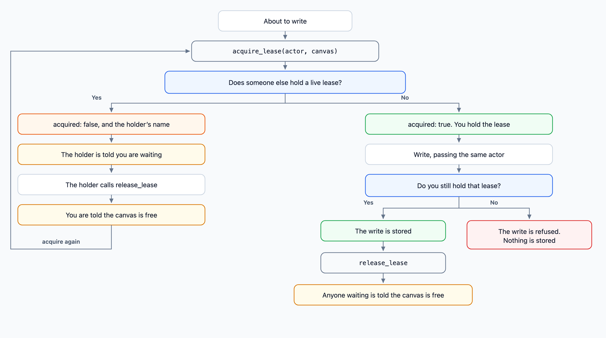

# Getting started

team-canvas turns a `.canvas.tsx` file (one React component) into a page your team can open and share. Agents write the source. This page takes you from install to the first canvas.

## 1. Install and run the server

You need Node 20 or newer.

```sh
npm install -g team-canvas
mkdir canvases
team-canvas serve ./canvases            # http://0.0.0.0:3847
```

No global install? `npx team-canvas serve ./canvases` does the same. To import `team-canvas/canvas` in your own React app (see step 7), install it in that project instead: `npm install team-canvas react react-dom`.

`./canvases` is the folder the server reads. Use `--host 127.0.0.1` to keep it on your machine and `--port` to change the port. There is no login, so read the security note in the [README](../README.md#security) before exposing it.

## 2. What a canvas is

Agents add and edit canvases over MCP (`create_canvas`). A canvas id may contain `/`. Each segment uses letters, digits, `-` and `_`, and an existing name is never overwritten.

A canvas file looks like this (`canvases/hello.canvas.tsx`):

```tsx
import { Button, H1, Stack, Text, useCanvasState } from "team-canvas/canvas";

export default function Hello() {
  const [count, setCount] = useCanvasState("count", 0);
  return (
    <Stack gap={12} style={{ padding: 16 }}>
      <H1>Hello</H1>
      <Text>Clicked {count} times</Text>
      <Button onClick={() => setCount(count + 1)}>Click me</Button>
    </Stack>
  );
}
```

A canvas has one default-exported component and imports everything it needs from `team-canvas/canvas`: layout, forms, charts, a diff view, a todo list, DAG layout and theme hooks. `useCanvasState` values are saved next to the file as `hello.canvas.data.json`, so everyone who opens the canvas sees the same state.

## 3. The library

Open the server URL. The library is a tree. Each canvas has **Open**, **Code** and **Copy link**. Agents add and edit canvases over MCP. The library toggle is Folders (filesystem) and Knowledge (canvases reached from each id whose last segment is `index`, with everything else under Unlinked).

The example is served with `team-canvas serve examples/okf`. Those ids start at `team-canvas/index`, `guides/editing-workflow`, and `reference/mcp-tools`. An OKF root is `<project-name>/index`.

## 4. The viewer

**Open** renders the canvas. When an agent changes the file, the page rebuilds on its own. Build errors show on the page.


## 5. The code view

**Code** shows the source next to the live preview. It is read-only. Agents change it over MCP.


## 6. Let an AI agent edit canvases

The same edit operations are available to agents over MCP (stdio):

```json
{
  "mcpServers": {
    "team-canvas": {
      "command": "npx",
      "args": ["-y", "team-canvas", "mcp", "/absolute/path/to/canvases"]
    }
  }
}
```

Tools: `list_canvases`, `create_canvas`, `read_source`, `write_source`, `replace_in_source`, `search_source`, `inspect_orientation`, `add_oriented`, `fill_slots`, `list_links`, `backlinks`, `search_linked`. `create_canvas` takes an `id` and an optional `source`; without a source it writes a starter canvas, and it fails if the id already exists. For small changes to a big canvas the agent should find the text with `search_source` and change it with `replace_in_source` (`id`, `old_string`, `new_string`, optional `replace_all`). It fails if the text is missing or matches more than once, so an edit never lands in the wrong place; `write_source` replaces the whole file and is for full rewrites. Reading whole files wastes context. `add_oriented` and `fill_slots` return the same shape as the HTTP API: `{ ok, id, slots }`, where `slots` are the blanks still left, as `{ id, label }`.

When several agents share one store, a write needs a lease. Reads never do.



A lease lasts 5 minutes, or the `ttl_seconds` you pass, and never longer than 1 hour. Calling `acquire_lease` again while you hold it renews that time. If it expires first, the canvas is free and the next `acquire_lease` takes it; nobody is told, because a notice is sent only when someone releases. Agents can also tell each other what they are about to decide: `declare_intent`, `list_topics`, `escalate_topic` and `list_changes` find contradictions early, and a human settles them at `/settlement`. The README section "Agents that share a store" has the details.

## 7. Use a canvas in a normal React app

A canvas is a regular component, so it also works in your own Vite or TypeScript app. `team-canvas/canvas` resolves through the package exports, no alias needed. Outside the server, `useCanvasState` is plain in-memory state. See `examples/vite/vite.config.ts` in the repo.

## 8. Move canvases from another canvas module

If your canvases import from a different module, rewrite them in place:

```sh
npx team-canvas convert --from <old-module> ./canvases
```

## Next

- Full HTTP API and architecture: [README](../README.md).
- Something missing? See the roadmap in the README.
